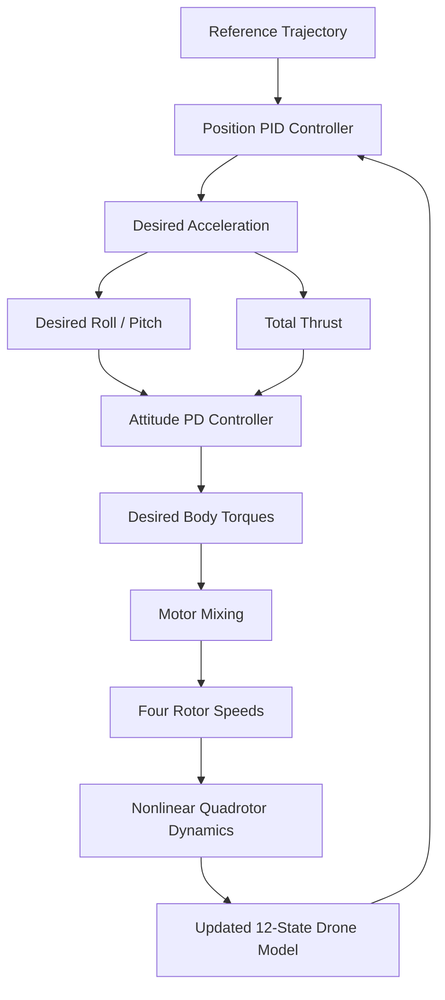
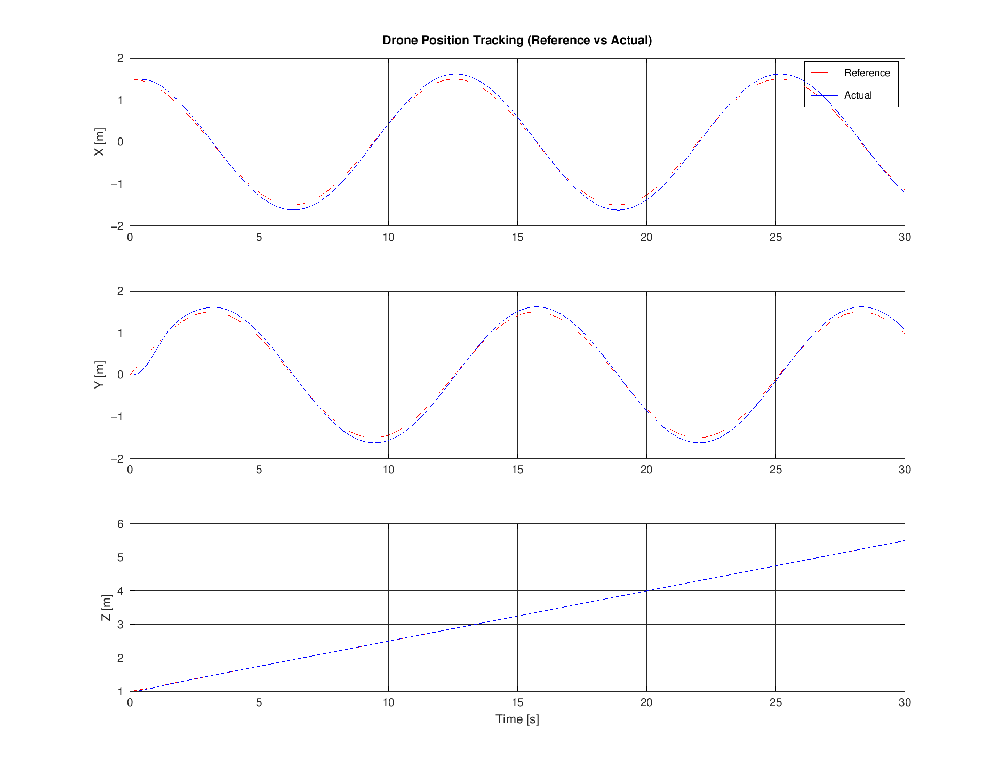
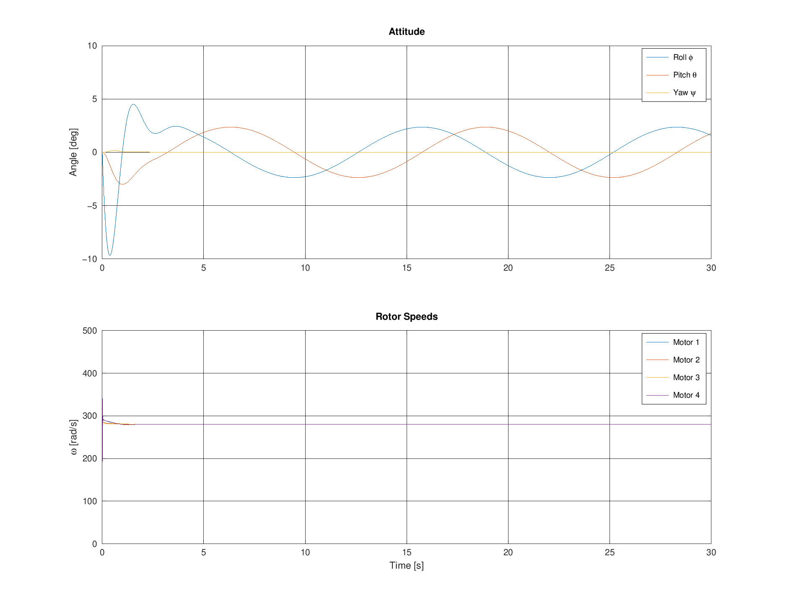
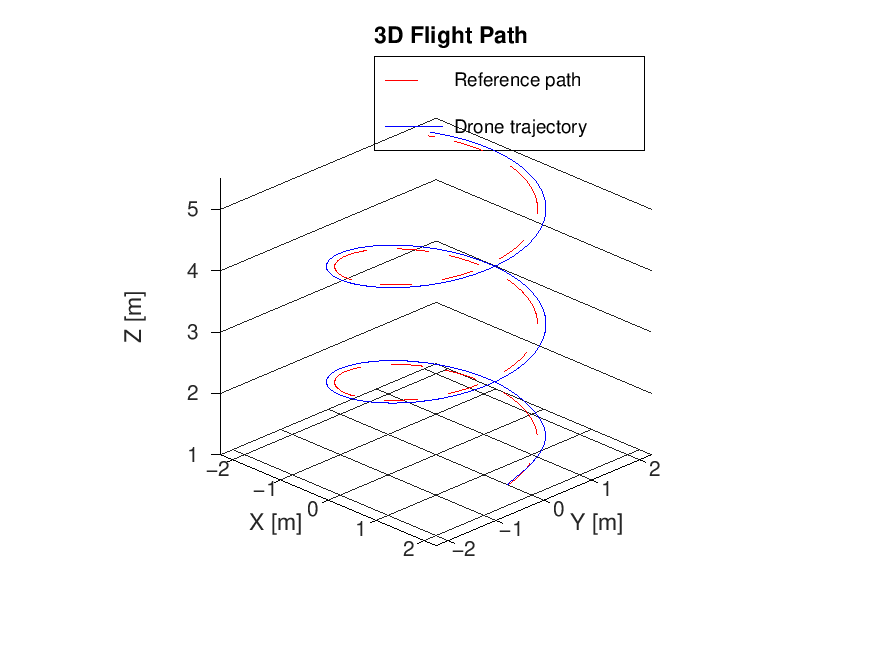
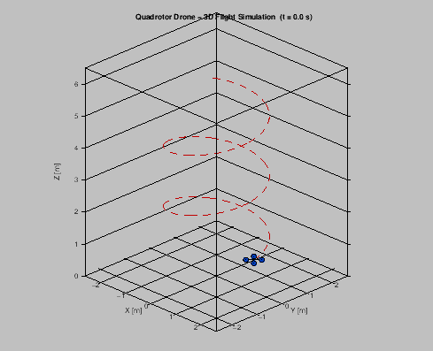

# 🚁 Quadrotor Flight Simulation

A MATLAB/GNU Octave simulation of a quadrotor drone performing closed-loop trajectory tracking using a cascaded PID controller, nonlinear 6-DOF rigid-body dynamics, and motor mixing.

The simulation commands a **rising helical trajectory**, computes the required thrust and body torques, converts those commands into four rotor speeds, and integrates the quadrotor dynamics over a **30-second flight**.

---

## 📌 Overview

This project models the main computational components of a quadrotor flight-control system:

* Nonlinear 6-DOF rigid-body dynamics
* Cascaded position PID and attitude PD control
* X-configuration motor mixing
* Reference trajectory generation
* Position and attitude tracking
* Rotor-speed logging
* 3D flight-path visualization
* Animated quadrotor visualization
* Position-tracking RMSE calculation

---

## ⚙️ System Workflow



The simulation follows a closed-loop control process:

**Reference Trajectory → Position Control → Desired Acceleration → Attitude Control → Motor Mixing → Rotor Speeds → Quadrotor Dynamics → Feedback**

---

## 🧮 Mathematical Model

The quadrotor is represented using a **12-state rigid-body model**:

```text
[x, y, z,
 x_dot, y_dot, z_dot,
 phi, theta, psi,
 p, q, r]
```

where:

| Variable              | Description                 |
| --------------------- | --------------------------- |
| `x, y, z`             | Inertial-frame positions    |
| `x_dot, y_dot, z_dot` | Linear velocities           |
| `phi, theta, psi`     | Roll, pitch, and yaw angles |
| `p, q, r`             | Body-frame angular rates    |

The model uses a **ZYX yaw-pitch-roll rotation convention** and includes translational and rotational rigid-body dynamics.

---

## 🎮 Control Strategy

### Outer Position Loop

The outer loop uses **PID control** to calculate the desired acceleration from position and velocity tracking errors.

```text
Position Error
      +
Velocity Error
      ↓
   PID Control
      ↓
Desired Acceleration
```

The desired vertical acceleration is converted into total thrust with gravity compensation. Desired horizontal accelerations are mapped to roll and pitch commands.

### Inner Attitude Loop

The inner loop uses **PD control** to track the desired roll, pitch, and yaw angles and generate the required body torques.

```text
Desired Attitude
      -
Actual Attitude
      ↓
    PD Control
      ↓
Body Torques
```

Integral windup protection is included in the position controller by limiting the accumulated position error.

---

## 🚁 Motor Mixing

The controller output is:

```text
[T, tau_phi, tau_theta, tau_psi]
```

where:

| Variable    | Description  |
| ----------- | ------------ |
| `T`         | Total thrust |
| `tau_phi`   | Roll torque  |
| `tau_theta` | Pitch torque |
| `tau_psi`   | Yaw torque   |

The motor mixer allocates these commands to four individual rotors using an **X-configuration mixing matrix**.

Rotor thrust follows:

```text
f_i = kF * omega_i^2
```

where:

* `kF` = rotor thrust coefficient
* `omega_i` = rotor angular speed

Rotor speeds are constrained to the configured physical limits.

---

## 🌀 Reference Trajectory

The default trajectory is a **rising helix**:

```text
x(t) = R cos(wt)
y(t) = R sin(wt)
z(t) = z0 + climb*t
```

### Trajectory Parameters

| Parameter             |     Value |
| --------------------- | --------: |
| Radius `R`            |     1.5 m |
| Angular speed `w`     | 0.5 rad/s |
| Climb rate            |  0.15 m/s |
| Initial altitude      |     1.0 m |
| Final simulation time |      30 s |

The trajectory is generated in:

```text
functions/get_reference.m
```

This makes it straightforward to replace the default helix with another trajectory.

---

## 📁 Project Structure

```text
QuadrotorDroneSim/
│
├── README.md
├── main_simulation.m
│
├── functions/
│   ├── quad_params.m
│   ├── quad_dynamics.m
│   ├── quad_controller.m
│   ├── motor_mixing.m
│   ├── get_reference.m
│   └── animate_quadrotor.m
│
└── results/
    ├── position_tracking.png
    ├── attitude_motors.png
    ├── flight_path_3d.png
    └── drone_animation.gif
```

---

## 📄 File Descriptions

| File                  | Purpose                                                  |
| --------------------- | -------------------------------------------------------- |
| `main_simulation.m`   | Main simulation script, logging, plotting, and animation |
| `quad_params.m`       | Defines drone physical parameters and controller gains   |
| `quad_dynamics.m`     | Computes nonlinear 6-DOF rigid-body dynamics             |
| `quad_controller.m`   | Implements cascaded position PID and attitude PD control |
| `motor_mixing.m`      | Converts total thrust and torques into four rotor speeds |
| `get_reference.m`     | Generates the desired rising-helical trajectory          |
| `animate_quadrotor.m` | Generates the 3D quadrotor animation                     |
| `results/`            | Contains generated plots and the animation               |

---

## ⚙️ Simulation Configuration

The current simulation uses:

| Parameter                |     Value |
| ------------------------ | --------: |
| Mass                     |    1.0 kg |
| Arm length               |   0.225 m |
| Gravity                  | 9.81 m/s² |
| Simulation time          |      30 s |
| Integration/control step |    0.01 s |
| Maximum rotor speed      | 838 rad/s |
| Maximum commanded tilt   |       30° |

The physical parameters and PID/PD gains can be modified in:

```text
functions/quad_params.m
```

---

## 💻 Requirements

### MATLAB

A recent MATLAB installation with standard numerical and plotting functionality is recommended.

### GNU Octave

The project can also be run using GNU Octave.

The animation function uses Octave's **image package** for GIF generation.

If required:

```matlab
pkg install -forge image
pkg load image
```

The project files use MATLAB-compatible syntax.

---

## ▶️ How to Run

1. Open MATLAB or GNU Octave.
2. Set the `QuadrotorDroneSim` folder as the current working directory.
3. Run:

```matlab
main_simulation
```

The script will:

1. Load the quadrotor parameters.
2. Generate the reference trajectory.
3. Run the cascaded flight controller.
4. Perform motor mixing.
5. Integrate the nonlinear quadrotor dynamics.
6. Calculate the position-tracking RMSE.
7. Generate tracking and attitude plots.
8. Generate the 3D flight-path plot.
9. Generate the animated GIF.

Generated results are saved automatically in:

```text
results/
```

---

## 📊 Results

The repository includes representative outputs from the simulation.

### Position Tracking



The plot compares the desired and simulated **X, Y, and Z positions** over time.

---

### Attitude and Rotor Speeds



This figure shows the simulated **roll, pitch, and yaw angles** together with the four rotor speeds.

---

### 3D Flight Path



The reference helical trajectory is compared with the simulated drone trajectory.

---

### Quadrotor Animation



The animation visualizes the quadrotor body, rotor locations, and flight trail along the simulated trajectory.

---

## 📈 Performance Metric

The simulation calculates the position-tracking RMSE using:

```text
RMSE = sqrt(mean(||p_reference - p_actual||^2))
```

The value printed by the simulation should be treated as the result for the specific parameter configuration and simulation run.

---

## 🔧 Customization

The project can be modified in several places.

### Change the Trajectory

Edit:

```text
functions/get_reference.m
```

The controller expects the reference generator to provide position, velocity, and yaw.

### Change Drone Parameters

Edit:

```text
functions/quad_params.m
```

This includes:

* Mass
* Inertia
* Arm length
* Rotor coefficients
* Rotor limits
* Controller gains

### Change Simulation Duration or Resolution

Edit the following values in:

```text
main_simulation.m
```

```matlab
dt = 0.01;
Tfinal = 30;
```

---

## ⚠️ Limitations

This is a computational simulation rather than a complete physical flight model.

The current implementation does not model effects such as:

* Aerodynamic drag
* Blade flapping
* Motor electrical dynamics
* Battery voltage variation
* Wind disturbances
* Ground effect
* Sensor noise
* Actuator delays
* Full aerodynamic rotor interactions

The model is therefore intended primarily for studying **quadrotor dynamics, trajectory tracking, and basic flight-control concepts**.

---

## 🚀 Future Improvements

Possible extensions include:

* Adding wind and external disturbances
* Adding sensor noise and state estimation
* Implementing a Kalman or complementary filter
* Modeling motor dynamics
* Comparing PID with LQR or nonlinear control
* Adding trajectory planning for different paths
* Adding controller performance comparisons
* Testing robustness under parameter uncertainty

---

## 👩‍💻 Author

**RISHITHA C**

Student Project — Computational Mechanics
